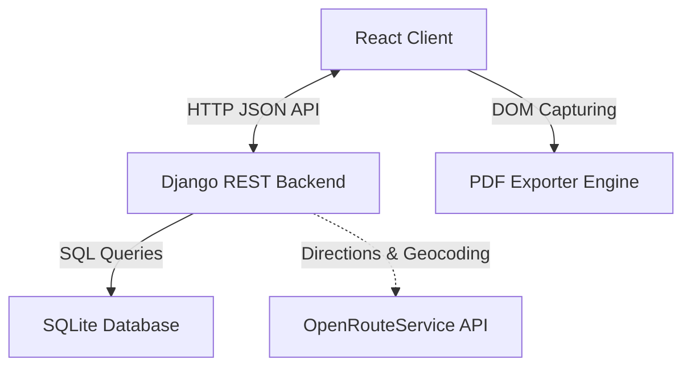

# Truck Route Planner & FMCSA Electronic Logging Device (ELD) Application

A complete, production-quality Truck Route Planner & FMCSA-compliant Electronic Logging Device (ELD) simulator. This application leverages React, Leaflet, Django REST Framework, and SQLite to calculate route geometries, plan commercial vehicle breaks, and render dynamic 24-hour daily driver logs (Form 395.8) in SVG format with PDF exports.

---

## Architecture Overview

The system uses a clean decoupled client-server architecture:



### Directory Structure

```
├── backend/
│   ├── core/                  # Project configuration settings
│   │   ├── settings.py        # Settings, CORS, DRF configuration
│   │   └── urls.py            # Main URL entries
│   ├── routing/               # Core application logic
│   │   ├── models.py          # Trip & TimelineEvent DB models
│   │   ├── serializers.py     # DRF serializers
│   │   ├── views.py           # REST endpoints (simulation & CRUD)
│   │   └── services/
│   │       ├── hos_calculator.py  # FMCSA Hours of Service engine
│   │       └── route_service.py   # Routing & geocoding interface
│   └── manage.py
├── frontend/
│   ├── src/
│   │   ├── components/
│   │   │   ├── Dashboard.jsx  # Main controls & form integration
│   │   │   ├── MapView.jsx    # Interactive Leaflet map container
│   │   │   ├── TripTimeline.jsx # Summary metrics & vertical timeline
│   │   │   └── LogSheet.jsx   # Dynamic 24-hour SVG log sheets
│   │   ├── services/
│   │   │   └── api.js         # Axios API connection client
│   │   ├── utils/
│   │   │   └── pdfExport.js   # Client-side PDF export compiler
│   │   ├── index.css          # Custom global & Leaflet theme
│   │   ├── App.jsx            # Routing and primary view setup
│   │   └── main.jsx
│   ├── tailwind.config.js     # Custom design system configuration
│   ├── postcss.config.js
│   └── index.html
└── README.md
```

---

## Core Algorithm: Hours of Service (HOS) Simulation

The core calculation logic lies in `backend/routing/services/hos_calculator.py`. It simulates the movement of the truck minute-by-minute across the planned segments.

### Implemented Regulations (FMCSA Part 395)
1. **11-Hour Driving Limit**: A driver may drive a maximum of 11 hours after 10 consecutive hours off duty.
2. **14-Hour Duty Window**: A driver may not drive after being on-duty (driving + loading/inspecting/refueling) for 14 hours since the start of their shift. The clock does *not* pause for rest breaks.
3. **30-Minute Break**: A driver must take a 30-minute off-duty break if more than 8 hours of cumulative driving has elapsed since their last off-duty period of 30+ minutes.
4. **10-Hour Off-Duty Reset**: Shift clocks (11h and 14h) are reset by taking 10 consecutive hours off duty.
5. **70-Hour / 8-Day Limit**: A driver cannot work after accumulating 70 duty hours (driving + on-duty-nd) in any rolling 8-day period. This is reset by a 34-hour consecutive off-duty restart.

### Event-Driven Simulation Flow
Rather than stepping by constant time increments, the algorithm uses an **Event-Driven Simulation**:
1. At the start of the trip, a **30-minute pre-trip inspection** (On-Duty Not Driving) is performed.
2. For each leg, we determine current driving speed (`distance / time`).
3. In each state, we calculate the remaining duration until the next critical limit event:
   - Driving time until the 8-hour break limit
   - Driving time until the 11-hour daily driving limit
   - Total time until the 14-hour daily duty window limit
   - Cumulative duty time until the 70-hour cycle limit
   - Odometer miles until the next **1,000-mile fuel stop**
   - Arrival at the segment destination
4. The simulation advances by the **minimum** of these durations:
   - If a limit is hit, the simulation inserts the required rest period (e.g. 30-min break, 10-hr rest, or 34-hr reset) and updates shift clocks.
   - If no limit is hit, the driver advances along the route.
5. Daily log sheets are generated by padding the start and end of the timeline to midnight boundaries and splitting any events that span across midnight. This ensures that every day is represented by exactly 24.0 hours.

---

## Getting Started

### Prerequisites
- Python 3.10+
- Node.js 18+

### 1. Backend Setup (Django)
Navigate to the `backend` folder, set up a virtual environment, and install dependencies:
```bash
# From workspace root
source venv/bin/activate # Or your system activate script
cd backend
python manage.py makemigrations
python manage.py migrate
```

Start the Django development server:
```bash
python manage.py runserver
```
The backend API will run on `http://localhost:8000`.

### 2. Frontend Setup (React)
Navigate to the `frontend` folder and install packages:
```bash
cd frontend
npm install
```

Start the Vite development server:
```bash
npm run dev
```
The frontend application will run on `http://localhost:5173`.

### 3. Routing API Configuration (Optional)
By default, the application runs in a **high-fidelity simulation fallback mode** if no OpenRouteService API key is provided. It geocodes common cities and generates realistic curved coordinates with correct highway distances (Haversine + circuity factor).
To use live routing:
1. Obtain an API key from [OpenRouteService](https://openrouteservice.org/).
2. Set the environment variable:
   ```bash
   export OPENROUTE_API_KEY="your_api_key_here"
   ```
3. Restart the Django server.

---

## API Endpoints

### 1. Trip Simulation (Stateless)
- **Endpoint**: `POST /api/trips/calculate/`
- **Payload**:
  ```json
  {
    "origin_address": "Chicago, IL",
    "pickup_address": "Kansas City, MO",
    "destination_address": "Denver, CO",
    "start_cycle_hours": 0.0,
    "start_time": "2026-07-22T08:00:00"
  }
  ```
- **Response**: Fully computed trip coordinates and timeline broken down into 24-hour days without writing to the database.

### 2. Save & Commit Trip
- **Endpoint**: `POST /api/trips/`
- **Payload**: Includes metadata (`carrier_name`, `vehicle_id`, `remarks`, etc.) in addition to calculation parameters.
- **Response**: Persisted trip details with its daily logs.

### 3. List Saved Trips
- **Endpoint**: `GET /api/trips/`
- **Response**: List of saved historical route plans.

### 4. Delete Saved Trip
- **Endpoint**: `DELETE /api/trips/<id>/`
# assig
